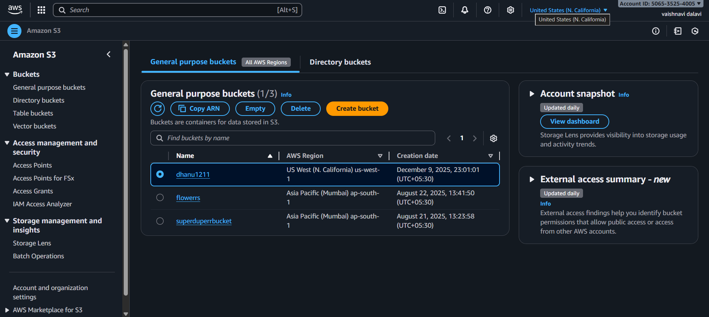

# Terraform-Task-Repo

# Task-Repo

# AWS Infrastructure Provisioning with Terraform

## 📌 Introduction
This project demonstrates how to provision essential AWS infrastructure using **Terraform**.  
It automates the creation of:

- Three EC2 instances  
- A security group with required inbound rules  
- An S3 bucket with versioning (used as a Terraform remote backend)

This setup follows Infrastructure as Code (IaC) best practices and maintains scalability, modularity, and security.

---

## 🏗 Infrastructure Components

### 🔹 1. EC2 Instances
Terraform creates **three EC2 instances**, each tagged for specific roles:

- `jump-server`
- `app-server`
- `db-server`

All configuration parameters such as:
- **AMI ID**
- **Instance Type**
- **Tags**

are modularized using **variables** to ensure reusability.


---

### 🔹 2. Security Group
A single **Security Group** is created and attached to all EC2 instances.


#### ✔ Allowed Inbound Rules:
- **SSH** – Port **22**
- **HTTP** – Port **80**
- **HTTPS** – Port **443**

#### ✔ Outbound Rules:
- All outbound traffic is allowed.

---

### 🔹 3. S3 Bucket (Remote Backend)
An S3 bucket is provisioned with:
- **Versioning enabled**  
- **Secure state file management**  

This bucket is used as the **remote backend**, ensuring:
- Reliable state storage  
- Team collaboration  
- State locking (if combined with DynamoDB)


---

## 📂 Project Structure

├── .gitignore
├── README.md
├── main.tf
├── variables.tf
├── backend.tf


---

## 🚀 How to Use

### 1️⃣ Initialize Terraform
```
bash
terraform init
```
## 2️⃣ View the planned changes
```
terraform plan
```
## 3️⃣ Apply the configuration
```
terraform apply -auto-approve
```


## ✅ Conclusion

This Terraform project automates the provisioning of AWS infrastructure, making it scalable, modular, and easy to maintain.
By implementing:

Variable-driven configuration

Remote state management

Organized resource definitions

the setup enhances operational efficiency while following IaC best practices.
